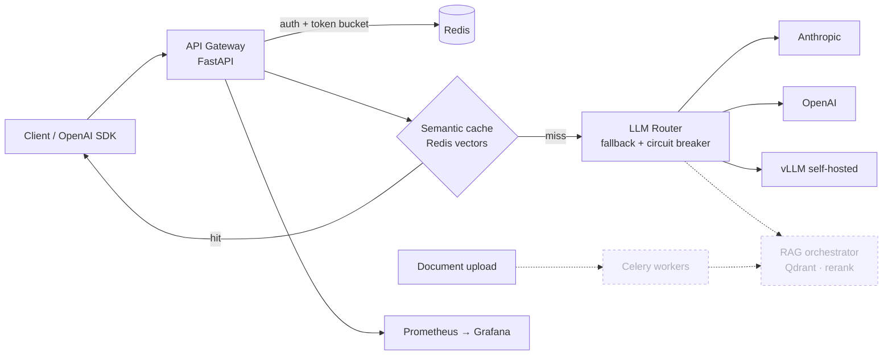

# NexusGate

**A production-grade LLM gateway and RAG backend.** NexusGate exposes one OpenAI-compatible API in front of several model providers. It falls back automatically when a provider fails and trips a circuit breaker when one keeps failing. Near-duplicate prompts are answered from a tenant-isolated semantic cache, so they cost nothing. Every request is authenticated, rate-limited, metered for tokens and dollars, and exported as Prometheus metrics.


<sub>Dashed components are on the roadmap below.</sub>

## Status

| Week | Milestone | State |
|---|---|---|
| 1 | Skeleton + gateway: FastAPI, Docker, health checks, multi-provider fallback | ✅ done |
| 2 | Semantic cache, API keys + JWT, per-key token-bucket rate limiting, cost metering | ✅ done |
| 3–4 | RAG: ingestion → chunking → embedding → Qdrant → rerank; P@5/R@5 eval set | ⏳ next |
| 5 | Celery workers: ingestion off the request path, job status, DLQ + backoff | ⏳ |
| 6 | Langfuse tracing, Grafana dashboard, error-budget alert | 🟡 Prometheus metrics + JSON logs done |
| 7 | Locust load test, breaking point, chaos test | 🟡 `chaos` route + fallback tests done |
| 8 | README polish, demo GIF, live deployment | ⏳ |

**Quality:** 96 tests (unit + integration + provider contract tests), **95.7% coverage**, ruff-clean. No test touches the network or spends API credits.

## Quickstart

```bash
cp .env.example .env            # add ANTHROPIC_API_KEY / OPENAI_API_KEY for real providers
docker compose -f infra/docker-compose.yml up --build
```

API docs: http://localhost:8000/docs · Prometheus: http://localhost:9090 · Grafana: http://localhost:3000

The `mock` and `chaos` routes work with **no API keys**:

```bash
# 1. Issue an API key (admin token comes from NEXUSGATE_ADMIN_TOKEN)
curl -s -X POST localhost:8000/v1/admin/keys \
  -H "X-Admin-Token: change-me-admin-token" -H "Content-Type: application/json" \
  -d '{"tenant_id": "acme", "name": "demo"}'

# 2. Chat. The second identical call is a cache hit: $0, no provider call.
curl -s localhost:8000/v1/chat/completions \
  -H "Authorization: Bearer ng_..." -H "Content-Type: application/json" \
  -d '{"model": "mock", "messages": [{"role": "user", "content": "What is a circuit breaker?"}]}'

# 3. Watch fallback: the primary of `chaos` always fails, so the secondary answers.
#    After 3 failures the breaker opens and the broken deployment is skipped outright.
curl -s localhost:8000/v1/chat/completions -H "Authorization: Bearer ng_..." \
  -H "Content-Type: application/json" \
  -d '{"model": "chaos", "cache": false, "messages": [{"role": "user", "content": "ping"}]}'

# 4. Usage and spend, including $ saved by the cache
curl -s localhost:8000/v1/usage -H "Authorization: Bearer ng_..."
```

Because the API is OpenAI-compatible, existing SDKs work unchanged:

```python
from openai import OpenAI
client = OpenAI(base_url="http://localhost:8000/v1", api_key="ng_...")
client.chat.completions.create(model="mock", messages=[{"role": "user", "content": "hi"}])
```

### Local development (no Docker)

```bash
python -m venv .venv && .venv/bin/pip install -e ".[dev]"   # Windows: .venv\Scripts\pip
pytest --cov
uvicorn app.main:create_app --factory --reload               # needs a Redis on localhost:6379
```

## API

| Endpoint | Auth | Purpose |
|---|---|---|
| `POST /v1/chat/completions` | key / JWT | OpenAI-shaped chat; response adds a `nexusgate` block (deployment, attempts, cost, cache hit) |
| `GET /v1/models` | key / JWT | Route aliases usable as `model` |
| `POST /v1/auth/token` | API key | Exchange a key for a short-lived JWT |
| `GET /v1/usage?days=7` | key / JWT | Daily requests, tokens, $ spent, $ saved by cache |
| `DELETE /v1/cache` | key / JWT | Purge the caller's tenant cache |
| `POST/GET/DELETE /v1/admin/keys` | admin token | Issue, list, revoke API keys |
| `GET /v1/admin/providers` | admin token | Route table + live circuit-breaker states |
| `DELETE /v1/admin/cache` | admin token | Purge the whole cache |
| `GET /healthz`, `/readyz`, `/metrics` | none | Liveness, readiness (Redis ping), Prometheus |

Every error uses one envelope: `{"error": {"type": ..., "message": ...}}`. A 429 carries `Retry-After`. A 503 from total provider failure includes each attempt.

## Design decisions

**Fallback lives in our router, not in LiteLLM.** LiteLLM is used only as a provider adapter, with `num_retries=0`. Retry, fallback and circuit breaking are ~150 lines in [`app/gateway/router.py`](app/gateway/router.py), so the behaviour is explicit and unit-tested, and every attempt shows up in the response and in metrics.

**Not every error triggers fallback.** Timeouts, 429s, 5xx and auth failures move on to the next deployment. A provider-side **400** fails fast: another vendor would reject the same malformed request, so the chain isn't burned. It also doesn't count against the breaker, because a bad request isn't an outage.

**Circuit breaker.** A deployment opens after N consecutive failures. After the cooldown it goes half-open and lets **exactly one** probe through; the probe's result either closes the breaker or reopens it for a fresh cooldown. State is kept per replica on purpose. Each replica learns about an outage within N requests, which is cheaper than a Redis round-trip on every call.

**The cache matches only the last user message semantically.** Tenant, route, temperature, max_tokens, system prompt and earlier turns are all hashed into an exact-match namespace. That way "answer in French" and "answer in English" can never share a cached answer, however close their embeddings are, and tenant A can never be served tenant B's response. Entries have a TTL, each namespace has a size cap, and there are purge endpoints. If the cache fails, requests are served uncached instead of erroring.

**Two vector-index backends behind one storage layout.** `redisearch` (an HNSW index in redis-stack) is what Docker Compose runs. `bruteforce` (a numpy dot product) needs no extra infrastructure and is what the tests use.

**Rate limiting is one Lua script.** The token-bucket refill-and-take runs atomically inside Redis, so replicas sharing a Redis never overspend a bucket. A test fires 50 concurrent requests at a 10-token bucket and asserts that exactly 10 get through.

**Only a SHA-256 of each API key is stored.** A Redis dump contains no usable credentials. JWTs are checked against the key record on every request, so revoking a key immediately kills its outstanding tokens. In `prod` the app refuses to start with the default secrets.

## Repository layout

```
app/
  api/            FastAPI routers: chat, account, admin, health
  core/           config, auth (API keys + JWT), rate limiting, metering, logging, DI container
  gateway/        provider adapters, routing config, circuit breaker, router, pricing, chat service
  cache/          embedders + semantic cache (bruteforce / RediSearch indexes)
  rag/            (weeks 3–4)
  workers/        (week 5)
  observability/  Prometheus metrics, request-ID middleware
config/routes.yaml  route aliases → ordered fallback chains, with per-deployment pricing
tests/unit, tests/integration
infra/            docker-compose, Prometheus, Grafana provisioning, k8s (stretch)
eval/             retrieval eval set + script (weeks 3–4)
```

## What I'd do with more time

Shared circuit-breaker state across replicas; streaming (SSE) responses; per-tenant Qdrant collections with a test proving tenant isolation; a model-comparison harness that feeds back into route ordering; Kubernetes with a HPA driven by queue depth.
