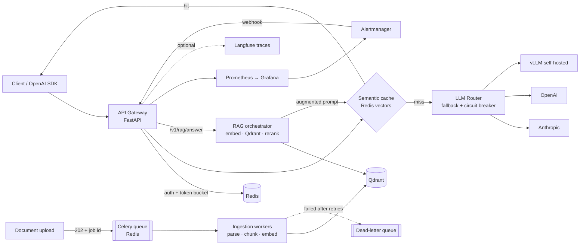

# NexusGate

[](https://github.com/ardhendudebnath/llm-gateway-rag/actions/workflows/ci.yml)

**NexusGate is a self-hosted LLM gateway and RAG backend: one OpenAI-compatible API in front of several model providers, with automatic fallback, circuit breakers and a tenant-isolated semantic cache.** Documents uploaded to it are ingested by background workers into Qdrant, and questions about them get reranked answers with numbered citations, served through the same gateway path. Every request is authenticated, rate-limited, metered in tokens and dollars, traced and exported to Prometheus, and the whole stack runs on Kubernetes, load-tested and chaos-tested.

**Try it in one container** (offline mock providers, no API keys, nothing to pay for):

```bash
podman build -f Containerfile.demo -t nexusgate-demo . && podman run --rm -p 7860:7860 nexusgate-demo
```

Then open http://localhost:7860. The page gives you an API key and curl commands to paste; `docker` works in place of `podman`.

<!-- Live demo: add the public URL here once it is deployed (see "Deploying the demo"). -->
<!-- Demo GIF:  (see "Recording the demo GIF"). -->


<sub>Dashed arrows are optional (tracing) or failure-only (dead letters) paths.</sub>

## Headline numbers

Measured on one 12-vCPU laptop shared by every component, with Locust running inside the cluster. Method, raw results and limitations: [loadtest/README.md](loadtest/README.md) and [eval/README.md](eval/README.md).

| What | Result |
|---|---|
| Chat throughput, p95 under 500 ms, <1% errors | **153.7 req/s**, up from 20.6 before the load-test fixes |
| RAG throughput, p95 under 1 s, <1% errors | **79 req/s**, up from 20.6 |
| Primary provider killed under traffic | **0 user-visible failures** in 2,100 requests; breakers opened 0.9 s after the fault |
| Retrieval quality, 48 labelled questions | **recall@5 1.000, MRR 0.990** |
| Tests | **227** (unit, integration, provider contracts), **96% coverage**, no network access, no API spend |

The load test found a real breaking point. Unbounded model inference OOM-killed the API at 50 users, with 74% errors. Bounding it with backpressure and graceful degradation took it to 0 errors at 200 users and 6× the throughput (see [Design decisions](#design-decisions)).

## Quickstart

There are three ways to run it, from quickest to most complete.

### 1. The one-container demo

This is the command at the top: the gateway, Redis, an in-process Qdrant and the real embedding and reranking models in one image ([`Containerfile.demo`](Containerfile.demo)). A fictional engineering handbook is pre-loaded for RAG. It is locked down so it can be put on the internet as is: mock providers only, one shared rate-limited key, uploads off (see [the design notes](#a-public-demo-thats-safe-to-expose)).

### 2. The full stack on Kubernetes

This runs 2 API replicas, a Celery worker, Redis, Qdrant, Prometheus, Alertmanager and Grafana on a local Kubernetes cluster: [kind](https://kind.sigs.k8s.io/) on [Podman](https://podman.io/). No Docker needed.

**Prerequisites:** Podman, kind and kubectl.
- On Windows: `winget install RedHat.Podman Kubernetes.kind Kubernetes.kubectl` (Podman uses WSL2).
- If PowerShell blocks the script, run it as `powershell -ExecutionPolicy Bypass -File .\scripts\cluster-up.ps1`.

```bash
cp .env.example .env              # optional: ANTHROPIC_API_KEY / OPENAI_API_KEY for real providers
./scripts/cluster-up.sh           # Windows: .\scripts\cluster-up.ps1
```

That one command does the following:
- Creates a rootful Podman machine if needed, then a kind cluster.
- Builds the image from the [`Containerfile`](Containerfile) with Podman and loads it into kind.
- Creates the Secret from `.env`, generating any admin, JWT or Qdrant secrets that `.env` lacks, and prints the admin token at the end.
- Applies the [kustomize overlay](infra/k8s/overlays/kind).

The embedding and reranking models are baked into the image, so pods never download weights. Re-running rebuilds the image and rolls the API. `scripts/cluster-down.sh` (or `.ps1`) deletes the cluster.

Once it is up:
- API docs: http://localhost:8000/docs
- Prometheus: http://localhost:9090
- Grafana: http://localhost:3000 (the **NexusGate** dashboard is provisioned automatically)

Check the running stack end to end. It uses mock routes only, so there are no API keys and no spend:

```bash
python scripts/smoke_test.py --admin-token "$ADMIN_TOKEN" --prometheus-url http://localhost:9090
```

The `mock` and `chaos` routes work with **no API keys**:

```bash
# 1. Issue an API key (the admin token is printed by cluster-up)
curl -s -X POST localhost:8000/v1/admin/keys \
  -H "X-Admin-Token: $ADMIN_TOKEN" -H "Content-Type: application/json" \
  -d '{"tenant_id": "acme", "name": "demo"}'

# 2. Chat. The second identical call is a cache hit: $0, no provider call.
curl -s localhost:8000/v1/chat/completions \
  -H "Authorization: Bearer ng_..." -H "Content-Type: application/json" \
  -d '{"model": "mock", "messages": [{"role": "user", "content": "What is a circuit breaker?"}]}'

# 3. Watch fallback: the primary of `chaos` always fails, so the secondary answers.
#    After 3 failures the breaker opens and the broken deployment is skipped outright.
curl -s localhost:8000/v1/chat/completions -H "Authorization: Bearer ng_..." \
  -H "Content-Type: application/json" \
  -d '{"model": "chaos", "cache": false, "messages": [{"role": "user", "content": "ping"}]}'

# 4. Usage and spend, including $ saved by the cache
curl -s localhost:8000/v1/usage -H "Authorization: Bearer ng_..."
```

RAG over your own documents (PDF, Markdown or text):

```bash
# Upload: returns 202 with a job id; a worker parses, chunks and embeds it
curl -s localhost:8000/v1/rag/documents -H "Authorization: Bearer ng_..." \
  -F file=@eval/corpus/incident-response.md

# Poll the job: queued -> processing -> done (or failed, with the reason)
curl -s localhost:8000/v1/rag/jobs/<job_id> -H "Authorization: Bearer ng_..."

# Search: vector top-20, reranked by a cross-encoder, top 5 returned
curl -s localhost:8000/v1/rag/search -H "Authorization: Bearer ng_..." \
  -H "Content-Type: application/json" -d '{"query": "when is a postmortem due?"}'

# Answer with numbered citations, through the normal gateway path (fallback, cache, metering)
curl -s localhost:8000/v1/rag/answer -H "Authorization: Bearer ng_..." \
  -H "Content-Type: application/json" \
  -d '{"question": "When is a postmortem due?", "model": "default"}'
```

Because the API is OpenAI-compatible, existing SDKs work unchanged:

```python
from openai import OpenAI

client = OpenAI(base_url="http://localhost:8000/v1", api_key="ng_...")
client.chat.completions.create(model="mock", messages=[{"role": "user", "content": "hi"}])
```

### 3. Local development (no cluster)

```bash
python -m venv .venv && .venv/bin/pip install -e ".[dev]"   # Windows: .venv\Scripts\pip
pytest --cov
uvicorn app.main:create_app --factory --reload               # needs a Redis on localhost:6379
```

## Demo walkthrough

[`scripts/demo.py`](scripts/demo.py) tells the whole story in seven narrated steps, paced for a screen recording:
1. Readiness.
2. A chat request goes to a provider.
3. The same question again is a semantic-cache hit: $0 and a few milliseconds.
4. A failing provider, and the fallback that answers.
5. An upload that is queued and then ingested by a worker.
6. A cited RAG answer.
7. Spend and cache savings.

It uses only the offline routes, so it costs nothing.

```bash
# Against the one-container demo: paste the key from the landing page
python scripts/demo.py --base-url http://localhost:7860 --key ng_...

# Against the Kubernetes stack: it mints a throwaway key and revokes it afterwards
python scripts/demo.py --admin-token "$ADMIN_TOKEN"
```

In the public demo, step 5 reports that uploads are disabled and moves on to the pre-loaded handbook. CI runs this same walkthrough against the demo image on every push.

### Recording the demo GIF

1. Start the Kubernetes stack and open Grafana (http://localhost:3000) next to a terminal, so the panels move while the script runs.
2. Record the terminal and run `python scripts/demo.py --admin-token "$ADMIN_TOKEN" --pace 2`. On Windows, [ScreenToGif](https://www.screentogif.com/) works well. On macOS or Linux, use `asciinema rec` and convert with [agg](https://github.com/asciinema/agg).
3. Save the result as `docs/demo.gif` and uncomment the image line at the top of this README.

### Deploying the demo

The demo image is self-contained, and the host needs to provide very little:
- **No volumes and no secrets.** Admin and JWT secrets are generated at start-up and never shown.
- **About 0.5 GB of memory** under light traffic (both ONNX models plus Redis).
- **A port.** It listens on `$PORT`, 7860 by default, which is what Hugging Face Spaces (Docker SDK) expects.

State lives in memory, so a restart resets the handbook, the usage counters and the shared key. For a demo, that is intended.

## API

| Endpoint | Auth | Purpose |
|---|---|---|
| `POST /v1/chat/completions` | key / JWT | OpenAI-shaped chat; response adds a `nexusgate` block (deployment, attempts, cost, cache hit) |
| `GET /v1/models` | key / JWT | Route aliases usable as `model` |
| `POST /v1/auth/token` | API key | Exchange a key for a short-lived JWT |
| `GET /v1/usage?days=7` | key / JWT | Daily requests, tokens, $ spent, $ saved by cache |
| `DELETE /v1/cache` | key / JWT | Purge the caller's tenant cache |
| `POST /v1/rag/documents` | key / JWT | Queue a PDF / Markdown / text file (multipart); **202** with a job; 413 over 10 MB, 415 unsupported or binary; 403 in the public demo |
| `GET /v1/rag/jobs[/{id}]` | key / JWT | Ingestion jobs: queued / processing / done / failed, with attempts and the failure reason |
| `GET /v1/rag/documents[/{id}]` | key / JWT | Your documents, newest first; one document's record |
| `DELETE /v1/rag/documents/{id}` | key / JWT | Delete a document and its chunks |
| `POST /v1/rag/search` | key / JWT | Top-k passages with vector and rerank scores |
| `POST /v1/rag/answer` | key / JWT | Grounded answer with numbered citations; no LLM call when nothing matches |
| `POST/GET/DELETE /v1/admin/keys` | admin token | Issue, list, revoke API keys |
| `GET /v1/admin/providers` | admin token | Route table + live circuit-breaker states |
| `GET/DELETE /v1/admin/dead-letters` | admin token | Jobs that failed for good; inspect or clear |
| `GET /v1/admin/alerts` | admin token | Alerts Alertmanager has delivered, newest first |
| `GET/PUT/DELETE /v1/admin/faults[/{deployment}]` | admin token | Chaos testing: make a deployment fail on every replica (off unless enabled) |
| `POST /v1/alerts/webhook` | basic auth | Alertmanager receiver (admin token as the password) |
| `DELETE /v1/admin/cache` | admin token | Purge the whole cache |
| `GET /healthz`, `/readyz`, `/metrics` | none | Liveness, readiness (Redis + Qdrant), Prometheus |
| `GET /` | none | Demo mode only: landing page with the shared key and examples |

Every error uses one envelope: `{"error": {"type": ..., "message": ...}}`. A 429 carries `Retry-After`. A 503 from total provider failure includes each attempt.

## Design decisions

**Fallback lives in our router, not in LiteLLM.** LiteLLM is used only as a provider adapter, with `num_retries=0`. Retry, fallback and circuit breaking are ~150 lines in [`app/gateway/router.py`](app/gateway/router.py), so the behaviour is explicit and unit-tested, and every attempt shows up in the response and in metrics.

**Not every error triggers fallback.** Timeouts, 429s, 5xx and auth failures move on to the next deployment. A provider-side **400** fails fast: another vendor would reject the same malformed request, so the chain isn't burned. It also doesn't count against the breaker, because a bad request isn't an outage.

**Circuit breaker.** A deployment opens after N consecutive failures. After the cooldown it goes half-open and lets **exactly one** probe through; the probe's result either closes the breaker or reopens it for a fresh cooldown. State is kept per replica on purpose. Each replica learns about an outage within N requests, which is cheaper than a Redis round-trip on every call.

**The cache matches only the last user message semantically.** Tenant, route, temperature, max_tokens, system prompt and earlier turns are all hashed into an exact-match namespace. That way "answer in French" and "answer in English" can never share a cached answer, however close their embeddings are, and tenant A can never be served tenant B's response. Entries have a TTL, each namespace has a size cap, and there are purge endpoints. If the cache fails, requests are served uncached instead of erroring.

**Two vector-index backends behind one storage layout.** `redisearch` (an HNSW index in redis-stack) is what the Kubernetes stack runs. `bruteforce` (a numpy dot product) needs no extra infrastructure; the tests and the one-container demo use it.

**Rate limiting is one Lua script.** The token-bucket refill-and-take runs atomically inside Redis, so replicas sharing a Redis never overspend a bucket. A test fires 50 concurrent requests at a 10-token bucket and asserts that exactly 10 get through.

**Only a SHA-256 of each API key is stored.** A Redis dump contains no usable credentials. JWTs are checked against the key record on every request, so revoking a key immediately kills its outstanding tokens. In `prod` the app refuses to start with the default secrets.

**RAG on Qdrant directly, no framework.** The pipeline is ~800 lines, docstrings included, in [`app/rag/`](app/rag), using `qdrant-client` and `fastembed` without LlamaIndex or LangChain. Every stage is small, injectable and unit-tested, and the retrieval eval runs the exact production code.
- **Chunking was chosen by measurement.** [Three strategies](app/rag/chunking.py) were compared on 48 labelled questions: fixed windows, sentence packing, and structure-aware chunks that start at every heading and carry a "title > heading path" prefix. Structure-aware won (MRR 0.924 vs 0.856 without a reranker). A cross-encoder rerank of the top 20 then reaches **recall@5 1.000, MRR 0.990** at ~230 ms per query. Full method, numbers and limitations: [eval/README.md](eval/README.md).
- **Multi-tenancy is enforced in the store.** It is one collection with a `tenant_id` payload index (`is_tenant=True`), and every query and delete carries a tenant filter. There is no code path that searches across tenants. A test proves tenant B can't retrieve or delete tenant A's documents.
- **Ingestion is idempotent.** Document ids are content hashes and point ids are UUIDv5 of (tenant, document, chunk), so re-uploads and retried jobs overwrite rather than duplicate.
- **Answers go through the normal chat path**, so they get fallback, circuit breaking, metering and the semantic cache. Retrieved passages sit in the system message, which is part of the cache namespace, so an answer is only reused when the *same* passages were retrieved. If nothing matches, the API says so without calling an LLM, so there is no cost and no invented answer.
- **Retrieved text is untrusted.** The prompt tells the model to treat passages as data and ignore instructions inside them. Uploads are type-checked, size-capped, and rejected if they contain NUL bytes (binaries disguised as text).
- **A 4× latency fix came from profiling.** Reranking first measured ~1 s per query: ONNX Runtime gave each model a 24-thread pool and the two pools fought over the CPU. Capping threads per model (`NEXUSGATE_MODEL_THREADS=4`) brought it to ~230 ms with identical scores.

**Degrade before failing, and shed before falling over.** The load test showed that unbounded model inference takes the API down: dozens of simultaneous ONNX runs pushed the pods past their memory limit. Each model now sits behind an [`InferenceGate`](app/core/concurrency.py): a fixed number of inferences run at once, a bounded number wait, and the rest are refused immediately.
- **Callers degrade first.** A saturated reranker means vector order is returned; a saturated embedder means chat skips the cache and still answers.
- **Only requests with no fallback are shed**, with a 503 and `Retry-After`.
- **Reranking has a 250 ms wait budget**, because it is optional work: waiting for it cost more than skipping it.
- **All of it is counted and alerted on:** `nexusgate_degraded_total`, `nexusgate_inference_shed_total`, and the `NexusGateSheddingLoad` alert.

**Chaos is a first-class API.** `PUT /v1/admin/faults/{deployment}` makes a deployment fail on demand, on every replica. The table lives in Redis, so it isn't one pod's memory, and it is cached for a second so it costs nothing per request. The failure is raised exactly where a real provider error would be, so it exercises the real retry, fallback and breaker paths. It is off unless `NEXUSGATE_FAULT_INJECTION_ENABLED` is set, which only the local cluster overlay does.

**Observability that can't take the service down.** Every completion produces a Langfuse generation (prompt, response, model, tokens, cost, cache hit) *and* a structured log line, both carrying the request id.
- **Tracing is optional and never fatal.** Without Langfuse credentials the gateway uses a no-op tracer. Every call into the SDK is guarded, and tests cover the cases where Langfuse can't be reached or fails mid-request: the request is still served.
- **One request id, end to end.** It is generated (or accepted) at the edge, carried in a `ContextVar` through gateway, router and provider, stored on the ingestion job, and restored inside the worker, so an upload and the job that fulfils it share one id across processes.
- **Alerts go somewhere by default.** Prometheus [rules](infra/k8s/base/config/alert-rules.yml) cover error rate, exhausted providers, open breakers, p95 latency, queue backlog, dead letters and a missing target. Alertmanager posts them to the gateway's own webhook, which logs and counts them, so the whole path works out of the box; switching to Slack or Discord is a receiver change, not a code change.
- **The dashboard ships with the stack.** [One JSON file](infra/k8s/base/config/grafana-dashboard.json) provisioned into Grafana: request rate, error rate, latency percentiles, provider outcomes and latency, cost per hour against cache savings, queue and dead-letter depth, and retrieval latency by stage.

**Ingestion runs in workers, not in the request.** Uploading returns **202** with a job id; a Celery worker does the parsing, chunking and embedding. A 10 MB PDF no longer holds an API worker for seconds, and ingestion capacity scales by scaling the worker Deployment alone.
- **The file doesn't travel through the broker.** Bytes are parked in Redis under a TTL and the queued message carries only a pointer. Celery messages stay small, and an upload whose job never runs expires by itself instead of leaking.
- **Two failure classes, opposite handling.** A bad upload (unsupported, no text, expired payload) fails immediately: retrying it would fail identically. An infrastructure error (Qdrant down, Redis blip) is retried with exponential backoff. Either way the final state lands in the [dead-letter queue](app/workers/jobs.py) with the reason, visible through the admin API.
- **Retry policy sits in the service, not the task**, so all of it is unit-tested without a broker: permanent failure, retry-then-succeed, and exhausting the last attempt.
- **Redelivery is safe.** `acks_late` plus `reject_on_worker_lost` mean a job whose worker is killed is redelivered rather than lost, and ingestion is idempotent, so re-running it overwrites rather than duplicates.
- **The same code path in tests.** An in-process queue runs jobs without a broker, so tests and `uvicorn` on a laptop behave like production: still 202, still polled.
- **Job counters live in Redis**, because the worker has no `/metrics` endpoint. The API publishes queue depth, dead-letter depth and per-outcome totals when Prometheus scrapes it, whichever process ran the job.

**Kubernetes, built with Podman.** The image is an OCI image built from a `Containerfile`, and the stack is plain kustomize: a cluster-agnostic [base](infra/k8s/base) plus a [kind overlay](infra/k8s/overlays/kind) that adds NodePorts and the locally built image.
- **Replicas:** the API runs 2 replicas. Rate limits, the cache and metering live in Redis, so they hold across replicas.
- **Per-pod scraping:** Prometheus discovers every API pod through a headless Service's DNS records. Each replica keeps its own counters, and scraping the load-balanced Service would sample a random pod each time.
- **Hardened pods:** they run as non-root with a read-only root filesystem and all capabilities dropped. An init container waits for Redis and Qdrant instead of letting the API crash-loop. Qdrant runs its unprivileged image and requires an API key.
- **Models in the image:** the embedding and reranking weights are downloaded at build time, and pods run with `HF_HUB_OFFLINE=1`. Startup is fast and needs no internet access.
- **Secrets:** they never enter git. The cluster-up script creates the Secret from `.env`. The pods run with `NEXUSGATE_ENV=prod`, which refuses default secrets.

### A public demo that's safe to expose

`NEXUSGATE_DEMO_MODE=true` ([`app/demo.py`](app/demo.py)) turns the same application into something a stranger can use:
- **Offline routes only** ([`config/routes.demo.yaml`](config/routes.demo.yaml)). The image holds no provider keys, so a visitor can't spend anything, and a test asserts the demo routes contain nothing but mock providers.
- **One shared key for a `demo` tenant, tightly rate-limited** (a burst of 20, then one request every 2 s). It is minted at start-up and shown on the landing page, and it changes on every restart.
- **Uploads are disabled.** Everyone shares the demo tenant, so accepting files would let one visitor serve content to the next. The handbook is ingested at start-up instead, before the server accepts traffic, so RAG works from the first request.
- **Admin stays closed** behind a random token that is never displayed, and a test checks that the public key can't open it.
- **It is the same code, not a fork.** Only configuration differs, and CI boots the image and runs the full walkthrough against it, so the demo can't drift from what is tested.

## Repository layout

```
app/
  api/            FastAPI routers: chat, rag, account, admin, alerts, health
  core/           config, auth (API keys + JWT), rate limiting, metering, embeddings,
                  bounded inference, logging, DI
  gateway/        provider adapters, routing config, circuit breaker, router, pricing,
                  fault injection, chat service
  cache/          semantic cache (bruteforce / RediSearch indexes)
  rag/            parsing, chunking, Qdrant store, reranking, retrieval, ingestion, grounded answers
  workers/        job records + DLQ, upload payloads, queues (celery / inline), Celery entry point
  observability/  Prometheus metrics, request-ID middleware, Langfuse tracing
  demo.py         public demo mode: shared key, pre-loaded handbook, landing page
config/
  routes.yaml       route aliases → ordered fallback chains, with per-deployment pricing
  routes.demo.yaml  the public demo's routes: mock providers only
tests/unit, tests/integration
infra/k8s/base            kustomize base: API, worker, Redis, Qdrant, Prometheus,
                          Alertmanager, Grafana + their config (rules, dashboard)
infra/k8s/overlays/kind   local kind cluster: NodePorts, Podman-built image, cluster config
scripts/          cluster-up / cluster-down (PowerShell + bash), smoke test, demo walkthrough
Containerfile       API and worker image for Kubernetes, built with Podman
Containerfile.demo  the one-container public demo
eval/             retrieval eval: fictional corpus, 48 labelled questions, harness, results
loadtest/         Locust traffic, in-cluster runner, chaos test, results and report
```

## How it was built

Eight weekly milestones, following the project spec:

| Week | Milestone | Outcome |
|---|---|---|
| 1 | Skeleton + gateway: FastAPI, Podman image + Kubernetes manifests, health checks, multi-provider fallback | ✅ |
| 2 | Semantic cache, API keys + JWT, per-key token-bucket rate limiting, cost metering | ✅ |
| 3–4 | RAG: ingestion → chunking → embedding → Qdrant → rerank; labelled eval set | ✅ recall@5 **1.000**, MRR **0.990** ([eval](eval/README.md)) |
| 5 | Celery workers: ingestion off the request path, job status, DLQ + backoff | ✅ |
| 6 | Langfuse tracing, Grafana dashboard, alerting | ✅ |
| 7 | Locust load test, breaking point, chaos test | ✅ breaking point found and fixed; 0 failures when a provider dies ([results](loadtest/README.md)) |
| 8 | README, demo walkthrough, one-container demo, live deployment | ✅ except the live URL: the image is deployable, hosting is pending |

## What I'd do with more time

- Shared circuit-breaker state across replicas.
- Streaming (SSE) responses.
- Hybrid retrieval (BM25 + dense), and an LLM-judged eval of answer faithfulness.
- A model-comparison harness that feeds back into route ordering.
- A HorizontalPodAutoscaler driven by CPU and inference queue depth: the load test showed CPU is now the limit.
- GPU inference or a smaller reranker, to lower the RAG latency floor.
- A soak test.
- A Helm chart for real clusters.
